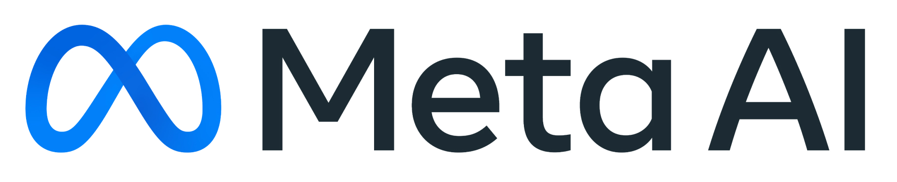

<h1 align="center">
  Neural Grasp Distance Fields for Robot Manipulation
</h1>

<div align="center">
  <a href="https://thomasweng.com/">Thomas Weng</a> &nbsp;•&nbsp;
  <a href="https://davheld.github.io/">David Held</a> &nbsp;•&nbsp;
  <a href="https://fmeier.github.io/">Franziska Meier</a> &nbsp;•&nbsp;
  <a href="https://www.mustafamukadam.com/">Mustafa Mukadam</a>
</div>

<h4 align="center">
  <a href="https://sites.google.com/view/neural-grasp-distance-fields"><b>Website</b></a> &nbsp;•&nbsp;
  <a href="https://arxiv.org/abs/2211.02647"><b>Paper</b></a> 
</h4>

<div align="center">

[](https://opensource.org/licenses/MIT) &nbsp; [](https://github.com/psf/black) &nbsp;&nbsp;&nbsp;&nbsp;&nbsp;&nbsp;   &nbsp;&nbsp; 
</div>


## Setup

1. Clone the repository: `git clone --recursive git@github.com:facebookresearch/NGDF.git`
2. Create a conda environment and install package dependencies

    ```
    conda env create -f ngdf_env.yml
    conda activate ngdf
    cd ngdf && pip install -e .
    ```
    Install [PyTorch](https://pytorch.org/get-started/locally/) separately, based on your CUDA driver version. The command below was tested on a 3080/3090 with CUDA 11.1:
    ```
    pip install torch==1.8.1+cu111 torchvision==0.9.1+cu111 -f https://download.pytorch.org/whl/torch_stable.html
    ```
3. Setup submodules

    * ndf_robot
        ```
        cd ndf_robot && pip install -e .
        ```
        Source ndf_robot whenever the conda env is activated
        ```
        conda activate ngdf
        cd $CONDA_PREFIX
        mkdir -p ./etc/conda/activate.d
        touch ./etc/conda/activate.d/ndf_env.sh
        echo "cd /PATH/TO/ndf_robot && source ndf_env.sh && cd -" >> ./etc/conda/activate.d/ndf_env.sh
        ```
        Download pre-trained `ndf_robot` weights: `ndf_robot/scripts/download_demo_weights.sh`
    * acronym
        ```
        cd acronym && pip install -e .
        ```

## Folder structure
```bash
NGDF
├── acronym                     # Submodule with utilities for ACRONYM dataset
├── contact_graspnet            # Submodule with ContactGraspnet for baselines
├── data                        # Datasets, models, and evaluation output
├── differentiable-robot-model  # Submodule for differentiable FK
├── ndf_robot                   # Submodule for pre-trained shape embedding
├── ngdf                        # Code for training and evaluating NGDF networks
├── OMG-Planner                 # Submodule with pybullet env, reach and grasp evaluation
├── scripts                     # Scripts for running training and evaluation
└── theseus                     # Submodule for differentiable FK and SE(3) ops
```

## Grasp Level Set Optimization Evaluation

1. Download dataset from this [Google Drive link](https://drive.google.com/drive/folders/1QPyhemprl0iybUjwFCkZpTBVM8lhma13?usp=sharing). 

    The dataset is required to get the closest grasp metric. 

2. Run evaluation
    * Download pre-trained models and configs into `data/models` from this [link](https://drive.google.com/drive/folders/1d4DjHp-YYIZMtESbLb9zYZavxQ14ny-2?usp=sharing)
    * Run grasp level set evaluations: 
    ```
    bash scripts/eval/grasp_level_set/perobj.sh
    bash scripts/eval/grasp_level_set/multobj.sh
    ```
    Results are stored in `eval/` in each model dir. 

    To evaluate the grasps in pybullet, you'll need to install the code in the following section, then run the above commands with a `-p` flag: `bash scripts/eval/grasp_level_set/perobj.sh -p`

## Reaching and Grasping Evaluation 

1. Set up dependencies

    * OMG-Planner, follow instructions in OMG-Planner README `OMG-Planner/README.md`

    * [pytorch3d](https://github.com/facebookresearch/pytorch3d/blob/main/INSTALL.md)
        ```
        pip install "git+https://github.com/facebookresearch/pytorch3d.git@stable"
        ```

    * differentiable-robot-model
        ```
        cd differentiable-robot-model
        git remote add parent https://github.com/facebookresearch/differentiable-robot-model.git
        git fetch parent
        python setup.py develop
        ```

    * theseus-ai
        ```
        cd theseus
        pip install -e .
        ```

    * Contact-GraspNet
        ```
        cd contact_graspnet
        conda env update -f contact_graspnet_env_tf25.yml
        sh compile_pointnet_tfops.sh
        pip install -e .
        ```
        Download trained model `scene_test_2048_bs3_hor_sigma_001` from [here](https://drive.google.com/drive/folders/1tBHKf60K8DLM5arm-Chyf7jxkzOr5zGl?usp=sharing) and copy it into the `checkpoints/` folder.


2. Run evaluation script
    ```
    bash scripts/eval/reach_and_grasp/perobj.sh
    ```
    The results are saved in `data/pybullet_eval`. Get summary results in jupyter notebook
    ```
    jupyter notebook --notebook-dir=scripts/eval/reach_and_grasp
    ```

## NGDF Training
1. Single object model training:
    ```
    bash scripts/train/perobj_Bottle.sh
    bash scripts/train/perobj_Bowl.sh
    bash scripts/train/perobj_Mug.sh
    ```
2. Multi-object model training;
    ```
    bash scripts/train/multobj_Bottle.sh
    ```

## Bibtex

```
@article{weng2022ngdf,
  title={Neural Grasp Distance Fields for Robot Manipulation,
  author={Weng, Thomas and Held, David and Meier, Franziska and Mukadam, Mustafa},
  journal={arXiv preprint arXiv:2211.02647},
  year={2022}
}
```

## License

The majority of NGDF is licensed under MIT license, however a portion of the project is available under separate license terms: ContactGraspNet is licensed under a [non-commericial NVidia License](https://github.com/NVlabs/contact_graspnet/blob/main/License.pdf).

## Contributing

We actively welcome your pull requests! Please see [CONTRIBUTING.md](.github/CONTRIBUTING.md) and [CODE_OF_CONDUCT.md](.github/CODE_OF_CONDUCT.md) for more info.
